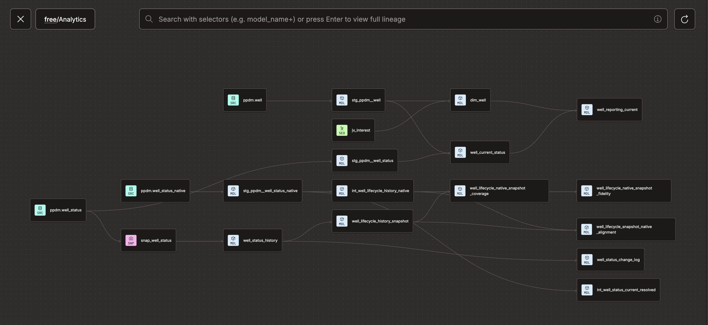
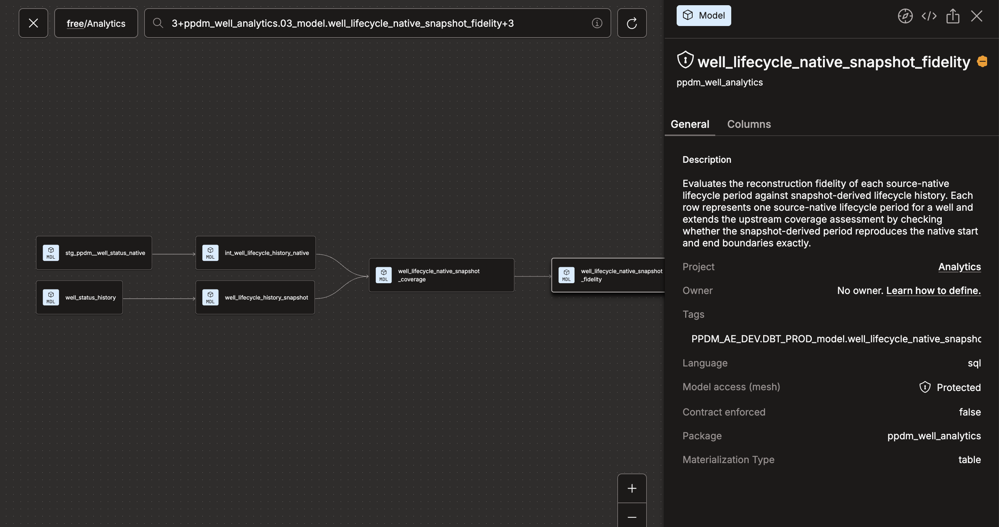
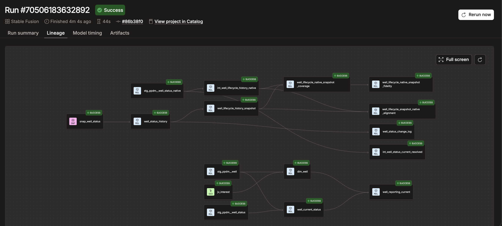

# PPDM Well Analytics Engineering

An independent analytics engineering prototype built with Snowflake and dbt Fusion, inspired by a real PPDM-based Power BI reporting use case.

The project explores how current-state well reporting, historical status tracking, change detection, data quality, and BI consumption can be moved into a governed analytics engineering workflow while preparing for an anticipated evolution of the upstream status schema.

I designed and implemented the dbt modelling architecture, historical reconstruction and reconciliation logic, data-quality controls, CI/CD workflow, and Power BI consumption interface demonstrated in this repository.

## Highlights

- Designed a stable **one-row-per-well** analytical interface for Power BI while separating relatively stable well attributes from mutable status.
- Reconstructed **SCD2 history** from a mutable current-state source using dbt snapshots.
- Modelled **source-native effective-dated history** separately from snapshot-observed history to preserve distinct business-time and observation-time semantics.
- Built **coverage and fidelity reconciliation** to identify lifecycle periods that snapshots missed or only partially reconstructed.
- Derived **field-level change events** from consecutive SCD2 versions using null-safe comparisons and incremental processing.
- Implemented **source-grain validation, temporal-integrity tests, PR-triggered CI, and production orchestration** as part of the end-to-end workflow.

---

## Project Background

The project was motivated by an existing Power BI reporting use case built on petroleum-domain source data and an anticipated evolution of the upstream status schema.

The current source primarily exposes mutable current-state well status. This is sufficient for answering questions such as:

> What is the status of each well today?

However, once a current record is overwritten, the source alone cannot reliably answer:

> What was the status of this well at an earlier point in time?

A future source design is expected to provide source-native, effective-dated status history.

Rather than waiting for that change, this project prototypes an analytical architecture that can support both the current and future states.

The design distinguishes three related but different concepts:

- **Current state** — the latest analytical representation of each well.
- **Snapshot-observed history** — SCD2 history reconstructed from changes observed in a mutable source.
- **Source-native business history** — effective-dated history representing when a status was valid in the business domain.

This distinction makes it possible not only to reconstruct historical state, but also to evaluate where snapshot-derived history can and cannot reproduce authoritative business history.

---

## PPDM Context

PPDM (Professional Petroleum Data Management) provides petroleum-industry data modelling standards for domain entities such as wells, status records, facilities, production, and related operational data.

A PPDM-style source model is organised around petroleum-domain entities and relationships rather than around a single report-ready analytical dataset.

This creates a natural analytics engineering boundary:

```text
PPDM domain data
       ↓
Snowflake
       ↓
dbt modelling and governance
       ↓
Reusable analytical models
       ↓
BI-ready presentation
       ↓
Power BI
```

The objective is to move reusable joins, business semantics, historical logic, and data-quality controls upstream rather than repeatedly implementing them inside individual reports.

---

## Tech Stack

| Technology | Role in the Project |
|---|---|
| **Snowflake** | Cloud data warehouse for source data, transformed models, historical data, and reporting datasets |
| **dbt Fusion** | Data modelling, testing, snapshots, documentation, lineage, and incremental processing |
| **dbt Cloud** | Development environment, CI/CD, production orchestration, and Catalog |
| **GitHub** | Version control, pull requests, and code review workflow |
| **Power BI** | Downstream BI consumption and report-specific presentation logic |
| **SQL / YAML** | Transformation logic, configuration, testing, and documentation |

---

## Architecture

The project follows a directional five-layer modelling architecture:

```text
00_source
    ↓
01_stage
    ↓
02_transform
    ↓
03_model
    ↓
04_presentation
    ↓
Power BI
```

Dependencies move downstream through the architecture. Consumer-facing models do not feed reporting-specific logic back into reusable lower layers.



### Layer Responsibilities

**00_source — Source definitions and assumptions**

Defines the PPDM source boundary and documents critical assumptions about source grain, identifiers, and required fields.

**01_stage — Source-aligned staging**

Standardises source fields while remaining close to source semantics. Business logic is deliberately limited at this layer.

**02_transform — Reusable transformation logic**

Contains reusable resolution and transformation logic that supports multiple downstream analytical models.

**03_model — Governed analytical models**

Contains reusable analytical structures including current state, SCD2 history, lifecycle history, reconciliation, and field-level change events.

**04_presentation — Consumer-ready datasets**

Combines reusable analytical models into stable datasets designed for downstream BI consumption.

Report-specific calculations remain downstream when they do not represent reusable analytical semantics.

---

## Project Structure

```text
models/
├── 00_source/
│   └── Source definitions and source-level validation
│
├── 01_stage/
│   └── Source-aligned staging models
│
├── 02_transform/
│   └── Reusable transformation and resolution logic
│
├── 03_model/
│   ├── Current-state analytical models
│   ├── SCD2 history
│   ├── Lifecycle history
│   ├── Native-vs-snapshot reconciliation
│   └── Field-level change events
│
└── 04_presentation/
    └── BI-ready reporting models

snapshots/
└── Mutable-source observation and SCD2 capture

tests/
└── Business-rule and temporal-integrity tests

seeds/
└── Controlled reference and mapping data

docs/images/
└── README architecture and execution evidence
```

---

## Key Models

Model grain is treated as an explicit design decision rather than an implementation detail.

| Model | Grain | Business Purpose |
|---|---|---|
| `dim_well` | One row per well | Governed well entity containing relatively stable well attributes |
| `well_current_status` | One row per well | Current analytical well status and classification |
| `well_reporting_current` | One row per well | BI-ready current-state reporting interface |
| `well_status_history` | One row per well per SCD2 version | Snapshot-observed historical well state |
| `well_status_change_log` | One row per changed field per version transition | Field-level events derived from consecutive SCD2 versions |
| `well_lifecycle_history_snapshot` | One row per reconstructed lifecycle period | Lifecycle history derived from snapshot observations |
| `int_well_lifecycle_history_native` | One row per source-native lifecycle period | Business-effective lifecycle history derived from native status records |
| `well_lifecycle_native_snapshot_coverage` | One row per native lifecycle period | Determines whether native history was observable within the snapshot window |
| `well_lifecycle_native_snapshot_fidelity` | One row per native lifecycle period | Evaluates how faithfully snapshot history reconstructs native lifecycle boundaries |

These grains deliberately separate current state, historical versions, lifecycle periods, and individual field-level change events.

---

## Current-State Reporting

The current reporting path produces a stable **one-row-per-well** interface for BI consumers.

```text
PPDM WELL
    ↓
stg_ppdm__well
    ↓
dim_well
    ──────────────┐
                  ↓
         well_reporting_current
                  ↑
                  │
PPDM WELL_STATUS  │
    ↓             │
stg_ppdm__well_status
    ↓
well_current_status
```

`dim_well` owns relatively stable well attributes, while `well_current_status` owns mutable status and classification.

`well_reporting_current` combines those reusable analytical concepts only after their grain and semantic ownership have been made explicit.

This reduces the need for downstream Power BI reports to repeatedly reproduce source joins and core business logic.

---

## Historical State

The current status source primarily represents mutable current state.

A dbt snapshot is therefore used to observe changes over time and reconstruct SCD2 history.

```text
PPDM WELL_STATUS
       ↓
snap_well_status
       ↓
well_status_history
       ↓
snapshot-derived lifecycle history
```

This provides valuable historical observability, but snapshot history has an important limitation:

> A snapshot can only record a state that it actually observed.

If a source record changes between snapshot executions, or if historical states existed before snapshot observation began, those business states may never appear in the reconstructed history.

For that reason, snapshot-derived history is treated as **observed history**, not automatically as authoritative business history.

---

## Business Time vs Observation Time

The project deliberately separates two temporal semantics.

### Business-effective time

Source-native effective dates answer:

> When was this status actually valid in the business domain?

### Observation time

Snapshot timestamps answer:

> When did the analytics platform observe the source in this state?

For example:

```text
Business event
Jan 10    Well becomes PRODUCING

Source update
Jan 12    Source record is updated

Snapshot observation
Jan 13    dbt first observes PRODUCING
```

All three dates may be valid, but they answer different questions.

The project therefore avoids treating source-native effective dates and snapshot `dbt_valid_from` / `dbt_valid_to` timestamps as interchangeable histories.

---

## Source-Native vs Snapshot Reconciliation

To demonstrate the limits of snapshot reconstruction, the project models source-native effective-dated lifecycle history alongside snapshot-derived history and reconciles the two.



Two related but distinct questions are evaluated.

### Coverage

`well_lifecycle_native_snapshot_coverage` asks:

> Was this source-native lifecycle period observable within the available snapshot history?

The model classifies each native lifecycle period as:

- `OBSERVED_WITHIN_SNAPSHOT_WINDOW`
- `PARTIALLY_OBSERVED_WITHIN_SNAPSHOT_WINDOW`
- `MISSED_WITHIN_SNAPSHOT_WINDOW`
- `BEFORE_SNAPSHOT_OBSERVATION`

Coverage therefore answers whether the native period was available to be reconstructed from snapshot observations.

### Fidelity

`well_lifecycle_native_snapshot_fidelity` asks a stricter question:

> If the native lifecycle period is compared with snapshot-derived history, how faithfully were its boundaries reconstructed?

The reconstruction status is classified as:

- `BEFORE_SNAPSHOT_OBSERVATION`
- `MISSED_NATIVE_PERIOD`
- `FULLY_RECONSTRUCTED`
- `PARTIALLY_RECONSTRUCTED`

Keeping coverage and fidelity separate prevents expected snapshot limitations from being incorrectly treated as data-quality failures.

---

## Field-Level Change Events

SCD2 history answers:

> What did the complete record look like at a point in time?

For auditing and analytical use cases, it is also useful to answer:

> What exactly changed?

`well_status_change_log` compares consecutive SCD2 versions using null-safe comparisons and emits one row per monitored field change.

Changes are classified as:

- `VALUE_CHANGE`
- `FORMAT_ONLY_CHANGE`
- `VALUE_POPULATED`
- `VALUE_CLEARED`

Baseline SCD2 records are excluded because the first observed version represents an initial state rather than a change event.

This creates three intentionally different analytical grains:

```text
Current state
1 row / well

SCD2 history
1 row / well / observed version

Change events
1 row / changed field / version transition
```

---

## Incremental Processing and Late-Arriving Data

The field-level change log is materialized incrementally.

Rather than rebuilding the entire SCD2-derived event history on every production run, the model reprocesses a recent lookback window.

The current implementation uses a **7-day lookback window** as a deliberate cost-versus-completeness trade-off.

This design captures normal recent corrections and late-arriving observations while avoiding unnecessary full-history recomputation.

The trade-off is explicit:

> Historical corrections outside the lookback window require a targeted backfill or full refresh.

This is treated as an operational design decision rather than assuming incremental processing can guarantee unlimited historical correction.

---

## Data Quality and Source Assumptions

Testing focuses on business assumptions, grain, and temporal integrity rather than on maximising test count.

Examples include:

- primary-key uniqueness and non-null validation,
- source-grain validation,
- relationship integrity,
- accepted domain values,
- one-current-record-per-well rules,
- SCD2 temporal overlap detection,
- native lifecycle overlap detection,
- snapshot lifecycle overlap detection,
- JV mapping consistency,
- current-state reconciliation,
- and compound uniqueness of field-level change events.

Critical source assumptions are documented and validated through source-level tests so that upstream changes fail visibly before propagating downstream.

For example, the current `WELL_STATUS` source-grain assumption is:

> **one mutable current record per well**

This assumption supports the current UWI-keyed snapshot design.

If the source evolves to multiple effective-dated records per well, the UWI uniqueness test should fail, signalling that the downstream snapshot, historical, current-state, and reporting assumptions must be reassessed.

This use of documentation and source-level tests should not be confused with dbt's enforced model-contract feature; the objective here is to make critical upstream modelling assumptions explicit and testable.

---

## CI/CD

Development changes are managed through GitHub branches and pull requests.

Pull requests trigger dbt Cloud CI so affected resources can be validated before merge.


The workflow separates development validation from production deployment:

```text
Development branch
       ↓
Pull request
       ↓
dbt Cloud CI
       ↓
Build and test affected resources
       ↓
Review / merge
       ↓
Production job
```

This makes automated validation part of the deployment workflow rather than a manual step performed only during development.

---

## Production Orchestration

Production execution is managed through dbt Cloud.

The production job builds the project DAG and validates its tests as part of the analytical workflow.



The execution graph provides operational evidence that current-state reporting, historical modelling, reconciliation, and change-event branches can run together as a coherent project.

---

## Power BI Consumption Design

The objective of the dbt layer is not to move every calculation out of Power BI.

Instead, logic is separated according to reuse and ownership.

### dbt owns

- reusable source integration,
- stable business keys,
- well-level semantics,
- current status resolution,
- historical state,
- lifecycle reconstruction,
- reusable data-quality rules,
- and BI-ready analytical interfaces.

### Power BI owns

- report-specific measures,
- visual calculations,
- presentation formatting,
- and logic meaningful only to a particular report.

`well_reporting_current` provides a stable one-row-per-well interface that reduces the need for downstream reports to repeatedly reproduce source joins and core business logic.

---

## Governance and Discoverability

The project uses dbt documentation and Catalog metadata to make model purpose, dependencies, and ownership easier to understand.

Model and column descriptions document:

- grain,
- business purpose,
- temporal meaning,
- and important data-quality assumptions.

Consumer-facing presentation models can therefore be understood in the context of their upstream lineage rather than as isolated warehouse tables.

Documentation is treated as part of the analytical product rather than as an afterthought.

---

## Key Design Decisions and Trade-offs

### Snapshot history is not treated as authoritative business history

Snapshots reconstruct what the platform observed. They cannot guarantee that every business state was captured.

### Native history and snapshot history remain separate

Business-effective dates and system-observation timestamps have different temporal semantics and are therefore not collapsed into a single timeline.

### Current-state and historical grains remain separate

A one-row-per-well reporting interface is not reused as a historical model, and historical versions are not pushed directly into current-state BI consumption.

### The change log uses a bounded incremental lookback

A seven-day lookback reduces routine processing cost while retaining a documented backfill path for older corrections.

### Models require a clear purpose

Intermediate and analytical models are introduced when they serve a business, quality, or architectural requirement rather than solely to demonstrate a dbt feature.

---

## Anticipated Source Evolution

A key motivation for the project is an anticipated evolution from mutable current-state status toward source-native effective-dated history.

If the upstream `WELL_STATUS` grain changes from:

```text
1 current row / well
```

to:

```text
many effective-dated status records / well
```

the existing assumptions should not simply be carried forward.

The migration would require reassessing:

- source grain and source-level validation,
- the snapshot business key,
- current-state resolution,
- business-effective history,
- lifecycle construction,
- change-event ordering,
- temporal-integrity tests,
- and downstream reconciliation.

The target principle is:

> **Effective-dated source fields describe business history; dbt snapshots describe observed source-record history.**

If authoritative native history becomes available, it should become the primary source for business-effective lifecycle analysis.

Snapshots should continue only where observation history or source-mutation auditing provides additional business value.

---

## Future Extensions

Potential next steps include:

- migrating lifecycle analysis to authoritative native history when the future source schema becomes available,
- retaining snapshot history selectively for audit and observation use cases,
- formalising presentation-layer contracts where downstream consumers require stronger schema guarantees,
- adding BI exposures when a stable production dashboard is available,
- and extending orchestration and monitoring as data volume and operational requirements grow.

These are intentionally treated as future requirements rather than features added solely for demonstration.

---

## Running the Project

The repository contains the dbt project logic but does not distribute the underlying PPDM source data or environment credentials.

A configured Snowflake and dbt environment is therefore required.

Typical project validation:

```bash
dbt parse
dbt build
```

Snapshot execution can also be run explicitly when required:

```bash
dbt snapshot
```

Pull-request validation and production execution are orchestrated through dbt Cloud.

---

## What This Project Demonstrates

This project demonstrates the ability to:

- design stable analytical grains for current-state and historical consumption,
- distinguish **business-effective time** from **system-observation time**,
- reconstruct SCD2 history and derive field-level change events,
- evaluate snapshot history using source-native **coverage and fidelity reconciliation**,
- protect critical upstream assumptions through documentation, source-level validation, and temporal-integrity tests,
- and operationalise analytical models through **Git-based CI/CD, dbt Cloud orchestration, and Power BI consumption**.

The central design goal is not simply to transform data, but to make **grain, history, business meaning, data quality, and downstream interfaces explicit and testable**.

Git Practice on 22 Aug.
